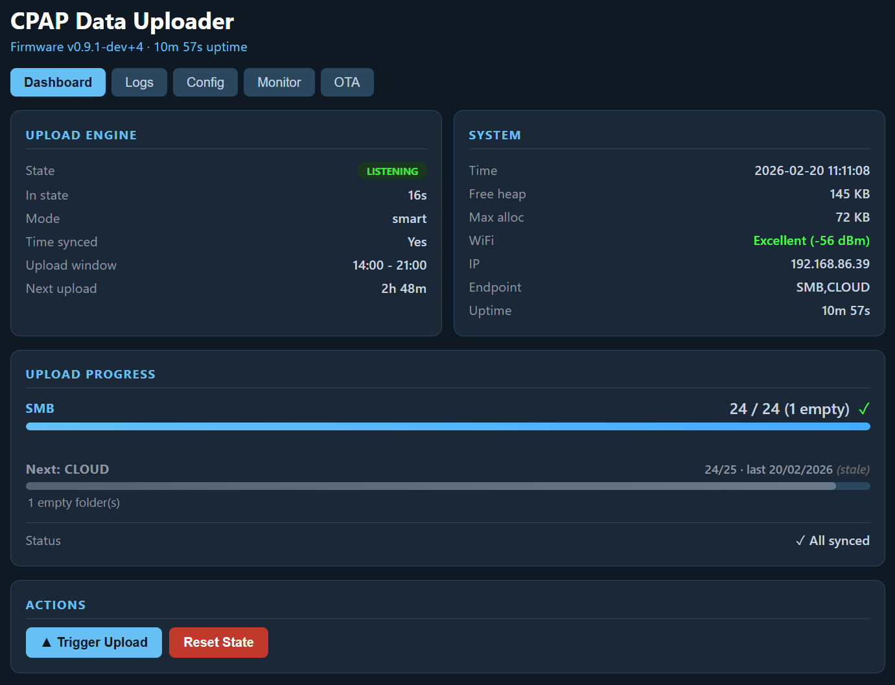

# ESP32 CPAP Data Uploader

Automatically upload CPAP therapy data from your SD card to a network share or SleepHQ — **within minutes of taking your mask off.**

**Supports:** ResMed Series 9, 10, and 11 · **Hardware:** [SD WIFI PRO](https://www.fysetc.com/products/fysetc-upgrade-sd-wifi-pro-with-card-reader-module-run-wireless-by-esp32-chip-web-server-reader-uploader-3d-printer-parts) (ESP32-based SD card adapter)



---

## 🚀 Quick Start — 4 Steps

### 1. Get the hardware
[SD WIFI PRO](https://www.fysetc.com/products/fysetc-upgrade-sd-wifi-pro-with-card-reader-module-run-wireless-by-esp32-chip-web-server-reader-uploader-3d-printer-parts) — an ESP32-based SD card adapter that replaces your CPAP's SD card slot.

### 2. Flash the firmware
👉 **[Download Latest Release](../../releases)** — includes firmware binaries and upload scripts for Windows, Mac, and Linux. Follow the included instructions.

### 3. Create `config.txt` on the SD card
Just WiFi credentials and upload destination — **6 to 10 lines total**.

**👇 Click your upload destination:**

<details>
<summary><b>📤 Network Share (SMB — Windows, NAS, Samba)</b></summary>

```ini
WIFI_SSID = YourWiFiName
WIFI_PASSWORD = YourWiFiPassword
ENDPOINT_TYPE = SMB
ENDPOINT = //192.168.1.100/cpap_backups
ENDPOINT_USER = username
ENDPOINT_PASSWORD = password
```
</details>

<details>
<summary><b>☁️ SleepHQ Cloud</b></summary>

```ini
WIFI_SSID = YourWiFiName
WIFI_PASSWORD = YourWiFiPassword
ENDPOINT_TYPE = CLOUD
CLOUD_CLIENT_ID = your-client-id
CLOUD_CLIENT_SECRET = your-client-secret
```
</details>

<details>
<summary><b>🔄 Both (SMB + SleepHQ simultaneously)</b></summary>

```ini
WIFI_SSID = YourWiFiName
WIFI_PASSWORD = YourWiFiPassword
ENDPOINT_TYPE = SMB,CLOUD
ENDPOINT = //192.168.1.100/cpap_backups
ENDPOINT_USER = username
ENDPOINT_PASSWORD = password
CLOUD_CLIENT_ID = your-client-id
CLOUD_CLIENT_SECRET = your-client-secret
```
</details>

### 4. Insert card and open `http://cpap.local`

That's it. The device connects to WiFi, waits for your therapy session to end, and uploads automatically.

Open **[http://cpap.local](http://cpap.local)** in your browser to see live upload status, view logs, and manage settings.

> **From here on, you can edit your config directly in the browser** — Config tab → Edit. No need to pull the SD card again.

---

## 🚨 Seeing an SD Card Error on your CPAP?

> Add these lines to `config.txt` and the errors will stop:

```ini
UPLOAD_MODE = scheduled
UPLOAD_START_HOUR = 9
UPLOAD_END_HOUR = 23
```

The default **smart** mode detects SD bus activity to know when it's safe to take the card. On some CPAP models this detection is unreliable — **scheduled mode avoids it entirely** by only uploading during a window you set (e.g. while you're awake and not on therapy).

See the [Full Setup Guide](release/README.md#️-sd-card-errors--use-scheduled-mode) for details.

---

## What You Get

- **Automatic uploads after every therapy session** — smart mode detects when your CPAP finishes and starts uploading within minutes
- **Uploads to Windows shares, NAS, or SleepHQ** — or both at the same time
- **Web dashboard at `http://cpap.local`** — live progress, logs, config editor, OTA updates
- **Edit config from the browser** — no SD card pulls after initial setup
- **Never uploads the same file twice** — tracks what's been sent, even across reboots
- **Respects your CPAP machine** — only accesses the SD card when therapy is not running

---

## Hardware

| | |
|---|---|
| **Adapter** | [SD WIFI PRO](https://www.fysetc.com/products/fysetc-upgrade-sd-wifi-pro-with-card-reader-module-run-wireless-by-esp32-chip-web-server-reader-uploader-3d-printer-parts) (ESP32-PICO-D4, 4MB Flash, WiFi 2.4GHz) |
| **CPAP machines** | ResMed Series 9, 10, and 11 |
| **WiFi** | 2.4GHz only (ESP32 limitation) |
| **Upload targets** | SMB/CIFS share, SleepHQ cloud, or both |

---

## Documentation

📖 **[Full Setup Guide](release/README.md)** — firmware flashing, all config options, troubleshooting, web interface reference

🔧 **[Developer Guide](docs/DEVELOPMENT.md)** — build from source, architecture, contributing

---

## License

This project is licensed under the **GNU General Public License v3.0 (GPL-3.0)**.

**What this means:**
- ✅ You can use this software for free
- ✅ You can modify the source code
- ✅ You can distribute modified versions
- ⚠️ **Any distributed versions (modified or not) must remain free and open source**
- ⚠️ Modified versions must also be licensed under GPL-3.0

This project uses libsmb2 (LGPL-2.1), which is compatible with GPL-3.0.

See [LICENSE](LICENSE) file for full terms.

## Legal & Trademarks

- **SleepHQ** is a trademark of its respective owner. This project is an unofficial client and is not affiliated with, endorsed by, or associated with SleepHQ.
  - This project uses the officially published [SleepHQ API](https://sleephq.com/api-docs) and does not rely on any non-official methods.
  - This project is **not intended to compete** with the official [Magic Uploader](https://shop.sleephq.com/products/magic-uploader-pro). We strongly encourage users to support the platform by purchasing the official solution, which comes with vendor support and requires no technical setup (flashing).
- **ResMed** is a trademark of ResMed. This software is not affiliated with ResMed.
- All other trademarks are the property of their respective owners.

### Disclaimer & No Warranty

**USE AT YOUR OWN RISK.**

This project (including source code, pre-compiled binaries, and documentation) is provided "as is" and **without any warranty of any kind**, express or implied.

**By using this software, you acknowledge and agree that:**
1.  **You are solely responsible** for the safety and operation of your CPAP machine and data.
2.  The authors and contributors **guarantee nothing** regarding the reliability, safety, or suitability of this software.
3.  **We are not liable** for any damage to your CPAP machine, SD card, loss of therapy data, or any other direct or indirect damage resulting from the use of this project.
4.  **Warranty Implication:** Using third-party accessories or software with your medical device may void its warranty. You accept this risk entirely.

This software interacts directly with medical device hardware and file systems. While every effort has been made to ensure safety, bugs or hardware incompatibilities can occur.

**GPL-3.0 License Disclaimer:**
> THERE IS NO WARRANTY FOR THE PROGRAM, TO THE EXTENT PERMITTED BY APPLICABLE LAW. EXCEPT WHEN OTHERWISE STATED IN WRITING THE COPYRIGHT HOLDERS AND/OR OTHER PARTIES PROVIDE THE PROGRAM "AS IS" WITHOUT WARRANTY OF ANY KIND, EITHER EXPRESSED OR IMPLIED, INCLUDING, BUT NOT LIMITED TO, THE IMPLIED WARRANTIES OF MERCHANTABILITY AND FITNESS FOR A PARTICULAR PURPOSE. THE ENTIRE RISK AS TO THE QUALITY AND PERFORMANCE OF THE PROGRAM IS WITH YOU. SHOULD THE PROGRAM PROVE DEFECTIVE, YOU ASSUME THE COST OF ALL NECESSARY SERVICING, REPAIR OR CORRECTION.

See the [LICENSE](LICENSE) file for the full legal text.

---

**Made for CPAP users who want automatic, reliable data backups.**

