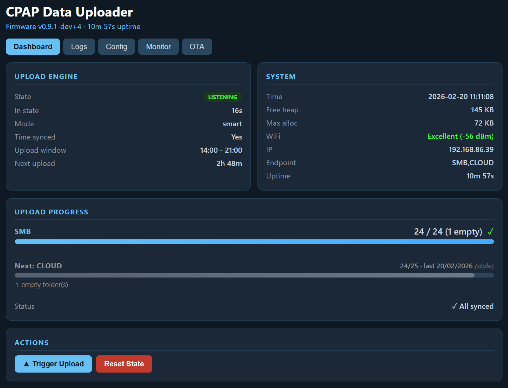

# ESP32 CPAP Data Uploader

Automatically upload CPAP therapy data from your SD card to a network share or SleepHQ — **within minutes of taking your mask off.**

**Supports:** ResMed Series 9, 10, and 11 · **Hardware:** [SD WIFI PRO](https://www.fysetc.com/products/fysetc-upgrade-sd-wifi-pro-with-card-reader-module-run-wireless-by-esp32-chip-web-server-reader-uploader-3d-printer-parts) (ESP32-based SD card adapter)

---

## ⚠️ **IMPORTANT COMPATIBILITY NOTICE**

These notices were shamessly stolen from https://raw.githubusercontent.com/ilyakruchinin/CPAP-AutoSync/refs/heads/main/README.md with permission of Ilya. Although the projects have diverged we still exchange information.

### **Power Compatibility & Known Hardware Limits**

> [!NOTE]
> ℹ️ **AirSense 10 units:** These machines power-cycle the SD card slot every 60 seconds while actively blowing air. This causes the ESP32 card to constantly reboot during therapy, which will degrade the Web UI experience while you are sleeping. However, **this does not affect functionality** — once you stop therapy (take off the mask or stop the machine from blowing air), the card will boot up normally and complete the upload as expected.

> [!CAUTION]
> ⚠️ **AirSense 11** ***(🔍 ONLY REF 39517, check back sticker! 🏷️)*** ➔ Most **REF 39517** units have severe power limitations on their SD card slot. If the ESP32 card does not receive enough power, it will continually reset. You may experience frequent WiFi disconnects, failed uploads, or an "**SD Card Error**" on your CPAP machine's screen.

We are currently gathering statistics on which models work reliably. **If your model is not listed below, please report your experience to help us improve this data.**

**👇👇👇 Click to expand:**
<details>
<summary><b>Detailed Model Compatibility Statistics</b></summary>

| Model | Made In | Platform | REF | Modem | Success rate | Notes |
| :--- | :--- | :--- | :--- | :--- | :---: | :--- |
| **AirSense 11** | Singapore | `R390-420/1` | 39480 | *(not specified / Europe)* | ✅ **100%** | Fully working |
| **AirSense 11** | Singapore | `R390-451/1` | 39483 | *(not specified / Europe)* | ✅ **100%** | Fully working |
| **AirSense 11** | Singapore | `R390-447/1` | 39517 | AIR11M1G22 | ❌ **35%** | Has known power delivery issues. Fails on most units. |
| ↳ *(modded)* | — | — | ↳ 39517 🔧 | — | ⚠️ **65%** | *With 1uF SD Extender Mod and `BROWNOUT_DETECT=OFF`* |
| **AirSense 11** | Singapore | `R390-447/1` | 39520 | AIR11M1G22 | ✅ **100%** | Fully working |
| **AirSense 11** | Singapore | `R390-447/1` | 39523 | AIR11M1U | ✅ **100%** | Stable since v1.0i-beta1 (had issues prior) |
| **AirSense 11** | Australia | `R390-453/1` | 39532 | AIR114GT | ✅ **100%** | Fully working |
| **AirSense 10** | Australia | `R370-4102/1` | 37043 | AIR104G | ✅ **100%** | ℹ️ Fully working, see notes |
| **AirSense 10** | Singapore | `R370-4201/1` | 37127 | *(not specified / Europe)* | ✅ **100%** | ℹ️ Fully working, see notes |
| **AirSense 10** | Singapore | `R370-4207/1` | 37160 | AIR104GU | ✅ **100%** | ℹ️ Fully working, see notes |
| **AirSense 10** | Australia | `R370-449/1` | 37437 | *(not specified / Australia)* | ✅ **100%** | ℹ️ Fully working, see notes |

> 💡 **TIP: Hardware Modification Work in Progress**
> 
> One of CPAP-AutoSync users is currently testing an **SD Card Extender mod** to add more capacitance to the power line. Initial tests show promising results (improving the R390-447/1 REF 39517 from 35% to 65% success rate). We are waiting for further testing with increased capacitance, which may fully resolve power issues for the problematic models. Investigations are also ongoing to see if a capacitor mod (or a newer AirSense firmware) might resolve the mid-therapy reboot issue on AirSense 10 units.

</details>

---

<details>
<summary><b>🔍 How to tell if your CPAP has power issues</b></summary>

> **⚠️ Identifying Power Issues**
>
> If your CPAP cannot provide enough power to the SD card, the ESP32 chip will reset itself. You might notice:
> - The device disappears from WiFi frequently
> - Uploads fail midway or never start
> - The web interface is unreliable
>
> You can confirm this is happening by looking at your logs:
> 1. If `PERSISTENT_LOGS=true` is set, check the downloaded logs from the web interface.
> 2. If the device cannot even stay online long enough to broadcast WiFi, pull the SD card and look for a file called `uploader_error.txt`.
>
> Look for this specific warning:
> ```text
> [INFO] Reset reason: Brown-out reset (low voltage)
> [ERROR] WARNING: System reset due to brown-out (insufficient power supply), this could be caused by:
> [ERROR]  - the CPAP was disconnected from the power supply
> [ERROR]  - the card was removed
> [ERROR]  - the CPAP machine cannot provide enough power
> ```

</details>

---



---

## 🚀 Quick Start — 4 Steps

### 1. Get the hardware
[SD WIFI PRO](https://www.fysetc.com/products/fysetc-upgrade-sd-wifi-pro-with-card-reader-module-run-wireless-by-esp32-chip-web-server-reader-uploader-3d-printer-parts) — an ESP32-based SD card adapter that replaces your CPAP's SD card slot.

### 2. Flash the firmware
👉 **[Download Latest Release](../../releases)** — includes firmware binaries and upload scripts for Windows, Mac, and Linux. Follow the included instructions.

### 3. Create `config.txt` on the SD card
Just WiFi credentials and upload destination — **6 to 10 lines total**.

**👇 Click your upload destination:**

<details>
<summary><b>📤 Network Share (SMB — Windows, NAS, Samba)</b></summary>

```ini
WIFI_SSID = YourWiFiName
WIFI_PASSWORD = YourWiFiPassword
ENDPOINT_TYPE = SMB
ENDPOINT = //192.168.1.100/cpap_backups
ENDPOINT_USER = username
ENDPOINT_PASSWORD = password
```
</details>

<details>
<summary><b>☁️ SleepHQ Cloud</b></summary>

```ini
WIFI_SSID = YourWiFiName
WIFI_PASSWORD = YourWiFiPassword
ENDPOINT_TYPE = CLOUD
CLOUD_CLIENT_ID = your-client-id
CLOUD_CLIENT_SECRET = your-client-secret
```
</details>

<details>
<summary><b>🔄 Both (SMB + SleepHQ simultaneously)</b></summary>

```ini
WIFI_SSID = YourWiFiName
WIFI_PASSWORD = YourWiFiPassword
ENDPOINT_TYPE = SMB,CLOUD
ENDPOINT = //192.168.1.100/cpap_backups
ENDPOINT_USER = username
ENDPOINT_PASSWORD = password
CLOUD_CLIENT_ID = your-client-id
CLOUD_CLIENT_SECRET = your-client-secret
```
</details>

### 4. Insert card and open `http://cpap.local`

That's it. The device connects to WiFi, waits for your therapy session to end, and uploads automatically.

Open **[http://cpap.local](http://cpap.local)** in your browser to see live upload status, view logs, and manage settings.

> **From here on, you can edit your config directly in the browser** — Config tab → Edit. No need to pull the SD card again.

---

## 🚨 Seeing an SD Card Error on your CPAP?

> Add these lines to `config.txt` and the errors will stop:

```ini
UPLOAD_MODE = scheduled
UPLOAD_START_HOUR = 9
UPLOAD_END_HOUR = 23
```

The default **smart** mode detects SD bus activity to know when it's safe to take the card. On some CPAP models this detection is unreliable — **scheduled mode avoids it entirely** by only uploading during a window you set (e.g. while you're awake and not on therapy).

See the [Full Setup Guide](release/README.md#️-sd-card-errors--use-scheduled-mode) for details.

---

## CPAP Compatibility

| Feature | AirSense 10 (AS10) | AirSense 11 (AS11) |
|---------|--------------------|--------------------|
| Upload mode: Smart | ❌ Not supported* | ✅ Supported |
| Upload mode: Scheduled | ✅ Supported | ✅ Supported |
| Stealth config read | ✅ Works | ✅ Works |
| SD bus mode | 1-bit (no DAT3) | 4-bit (DAT3 active) |

*AS10 uses 1-bit SD communication. The ESP32 cannot detect CPAP SD bus activity on DAT3, which Smart mode requires for automatic upload triggering. If `UPLOAD_MODE=smart` is set, the firmware automatically falls back to scheduled mode on AS10 units.

---

## What You Get

- **Automatic uploads after every therapy session** — smart mode detects when your CPAP finishes and starts uploading within minutes
- **Uploads to Windows shares, NAS, or SleepHQ** — or both at the same time
- **Web dashboard at `http://cpap.local`** — live progress, logs, config editor, OTA updates
- **Edit config from the browser** — no SD card pulls after initial setup
- **Never uploads the same file twice** — tracks what's been sent, even across reboots
- **Respects your CPAP machine** — only accesses the SD card when therapy is not running

---

## Hardware

| | |
|---|---|
| **Adapter** | [SD WIFI PRO](https://www.fysetc.com/products/fysetc-upgrade-sd-wifi-pro-with-card-reader-module-run-wireless-by-esp32-chip-web-server-reader-uploader-3d-printer-parts) (ESP32-PICO-D4, 4MB Flash, WiFi 2.4GHz) |
| **CPAP machines** | ResMed Series 9, 10, and 11 |
| **WiFi** | 2.4GHz only (ESP32 limitation) |
| **Upload targets** | SMB/CIFS share, SleepHQ cloud, or both |

---

## Documentation

📖 **[Full Setup Guide](release/README.md)** — firmware flashing, all config options, troubleshooting, web interface reference

🔧 **[Developer Guide](docs/DEVELOPMENT.md)** — build from source, architecture, contributing

---

## License

This project is licensed under the **GNU General Public License v3.0 (GPL-3.0)**.

**What this means:**
- ✅ You can use this software for free
- ✅ You can modify the source code
- ✅ You can distribute modified versions
- ⚠️ **Any distributed versions (modified or not) must remain free and open source**
- ⚠️ Modified versions must also be licensed under GPL-3.0

This project uses libsmb2 (LGPL-2.1), which is compatible with GPL-3.0.

See [LICENSE](LICENSE) file for full terms.

## Legal & Trademarks

- **SleepHQ** is a trademark of its respective owner. This project is an unofficial client and is not affiliated with, endorsed by, or associated with SleepHQ.
  - This project uses the officially published [SleepHQ API](https://sleephq.com/api-docs) and does not rely on any non-official methods.
  - This project is **not intended to compete** with the official [Magic Uploader](https://shop.sleephq.com/products/magic-uploader-pro). We strongly encourage users to support the platform by purchasing the official solution, which comes with vendor support and requires no technical setup (flashing).
- **ResMed** is a trademark of ResMed. This software is not affiliated with ResMed.
- All other trademarks are the property of their respective owners.

### Disclaimer & No Warranty

**USE AT YOUR OWN RISK.**

This project (including source code, pre-compiled binaries, and documentation) is provided "as is" and **without any warranty of any kind**, express or implied.

**By using this software, you acknowledge and agree that:**
1.  **You are solely responsible** for the safety and operation of your CPAP machine and data.
2.  The authors and contributors **guarantee nothing** regarding the reliability, safety, or suitability of this software.
3.  **We are not liable** for any damage to your CPAP machine, SD card, loss of therapy data, or any other direct or indirect damage resulting from the use of this project.
4.  **Warranty Implication:** Using third-party accessories or software with your medical device may void its warranty. You accept this risk entirely.

This software interacts directly with medical device hardware and file systems. While every effort has been made to ensure safety, bugs or hardware incompatibilities can occur.

**GPL-3.0 License Disclaimer:**
> THERE IS NO WARRANTY FOR THE PROGRAM, TO THE EXTENT PERMITTED BY APPLICABLE LAW. EXCEPT WHEN OTHERWISE STATED IN WRITING THE COPYRIGHT HOLDERS AND/OR OTHER PARTIES PROVIDE THE PROGRAM "AS IS" WITHOUT WARRANTY OF ANY KIND, EITHER EXPRESSED OR IMPLIED, INCLUDING, BUT NOT LIMITED TO, THE IMPLIED WARRANTIES OF MERCHANTABILITY AND FITNESS FOR A PARTICULAR PURPOSE. THE ENTIRE RISK AS TO THE QUALITY AND PERFORMANCE OF THE PROGRAM IS WITH YOU. SHOULD THE PROGRAM PROVE DEFECTIVE, YOU ASSUME THE COST OF ALL NECESSARY SERVICING, REPAIR OR CORRECTION.

See the [LICENSE](LICENSE) file for the full legal text.

---

**Made for CPAP users who want automatic, reliable data backups.**

